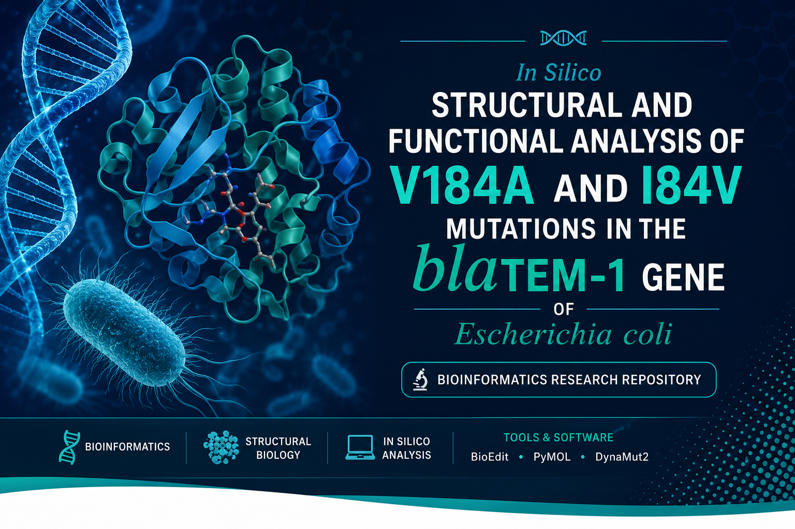

  

# In Silico Structural and Functional Analysis of V184A and I84V Mutations in the blaTEM-1 Gene of *Escherichia coli*

**Repository:** `blaTEM-1-Escherichia-coli`
## 📑 Table of Contents

- [📖 Project Overview](#-project-overview)
- [🎯 Research Objectives](#-research-objectives)
- [🧪 Bioinformatics Workflow](#-bioinformatics-workflow)
- [🛠 Software & Tools](#-software--tools)
- [📂 Repository Structure](#-repository-structure)
- [📊 Results](#-results)
- [📈 Key Findings](#-key-findings)
- [👤 Author](#-author)
- [📜 License](#-license)

## Project Overview

This repository contains the computational workflow and analysis performed to investigate the structural and functional effects of two amino acid mutations (V184A and I84V) in the blaTEM-1 β-lactamase gene of *Escherichia coli*. The study was conducted using publicly available nucleotide and protein sequence databases together with structural bioinformatics tools.

---

## Research Objectives

- Retrieve wild-type and mutant blaTEM-1 sequences.
- Identify nucleotide and amino acid mutations.
- Compare wild-type and mutant protein sequences.
- Analyze the three-dimensional structure of TEM-1 β-lactamase.
- Evaluate the structural and stability effects of V184A and I84V mutations.

---

## Bioinformatics Workflow

1. Sequence retrieval from NCBI and ENA.
2. Multiple sequence alignment using BioEdit.
3. Identification of nucleotide mutations.
4. Translation of nucleotide sequences into protein sequences.
5. Retrieval of the TEM-1 crystal structure (PDB ID: 1BTL).
6. Structural visualization and residue verification using PyMOL.
7. Protein stability analysis using DynaMut2.
8. Comparative analysis of wild-type and mutant proteins.

---

## Software and Databases

- NCBI
- European Nucleotide Archive (ENA)
- BioEdit
- RCSB Protein Data Bank (PDB)
- PyMOL
- DynaMut2
## 📂 Repository Structure

## Mutations Investigated

- I84V
- V184A

---

## Repository Status

This repository documents the computational workflow, analyses, and results of the project.

---

## Author

Atahullah

BS Microbiology

---

## License

This project will be released under the MIT License.
