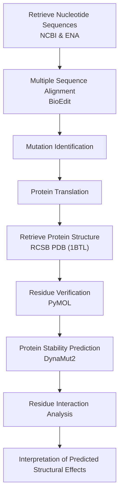

<p align="center">
  
</p>

<h1 align="center">
🧬 In Silico Structural Analysis of I84V and V184A Mutations in TEM-1 β-Lactamase of <i>Escherichia coli</i>
</h1>

<p align="center">


</p>

<p align="center">

<b>Computational Structural Bioinformatics Research Repository</b>

</p>

---

# 📖 Project Overview

Antimicrobial resistance (AMR) is one of the most significant global public health challenges, threatening the effectiveness of antibiotics used to treat bacterial infections. Among Gram-negative bacteria, the **TEM-1 β-lactamase** enzyme is one of the most prevalent resistance determinants and plays an important role in resistance to β-lactam antibiotics.

This repository presents an **in silico structural bioinformatics study** investigating two amino acid substitutions (**I84V** and **V184A**) in the TEM-1 β-lactamase protein of *Escherichia coli*. The study uses publicly available nucleotide sequences, experimentally determined protein structures, and established computational tools to evaluate the predicted structural consequences of these substitutions.

The computational workflow includes:

- Retrieval of nucleotide sequences
- Multiple sequence alignment
- Mutation identification
- Protein translation
- Protein structure retrieval
- Residue verification
- Structural visualization
- Protein stability prediction
- Residue interaction analysis
- Interpretation of predicted structural effects

Wild-type and mutant nucleotide sequences were obtained from publicly available databases, aligned using **BioEdit**, translated into protein sequences, and compared with the experimentally determined TEM-1 crystal structure (**PDB ID: 1BTL**). Structural visualization was performed using **PyMOL**, while predicted stability changes and residue interaction networks were analyzed using **DynaMut2**.

This repository provides the datasets, computational workflow, analysis outputs, figures, and supporting documentation generated during this undergraduate bioinformatics research project. It is intended as a reproducible educational resource for students and researchers interested in structural bioinformatics, protein mutation analysis, and antimicrobial resistance.

---

# ⭐ Project Highlights

- 🧬 Complete computational bioinformatics workflow
- 🔬 Structural analysis of TEM-1 β-lactamase
- 🧪 Investigation of two naturally occurring amino acid substitutions
- 📊 Protein stability prediction using DynaMut2
- 🖥 Three-dimensional structural visualization using PyMOL
- 📂 Reproducible workflow using publicly available datasets
- 🎓 Undergraduate research project in Microbiology
- 📚 Open-source scientific documentation on GitHub

---
# 🎯 Research Objectives

## Primary Objective

To investigate the predicted structural effects of the **I84V** and **V184A** amino acid substitutions in the TEM-1 β-lactamase protein of *Escherichia coli* using computational structural bioinformatics approaches.

---

## Specific Objectives

- Retrieve wild-type and mutant **blaTEM-1** nucleotide sequences from publicly available databases.
- Perform multiple sequence alignment to identify nucleotide variations.
- Translate nucleotide sequences into protein sequences.
- Verify amino acid substitutions through protein sequence comparison.
- Retrieve the experimentally determined crystal structure of TEM-1 β-lactamase (PDB ID: **1BTL**).
- Verify residue numbering and visualize protein structures using PyMOL.
- Predict mutation-induced protein stability changes using DynaMut2.
- Compare residue interaction networks between wild-type and mutant proteins.
- Interpret the predicted structural consequences of the investigated amino acid substitutions.

---

# 📑 Table of Contents

- 📖 Project Overview
- ⭐ Project Highlights
- 🎯 Research Objectives
- 🧬 Bioinformatics Workflow
- 🔬 Materials and Methods
- 🛠 Software and Databases
- 📂 Repository Structure
- 📊 Results
- 💡 Discussion
- ⚠ Scientific Scope
- ⚠ Limitations
- 🚀 Future Work
- 🔄 Reproducibility
- 📚 Citation
- 🙏 Acknowledgements
- 👨‍💻 Author
- 📜 License

---

# 🧬 Bioinformatics Workflow

The study followed a systematic computational workflow to investigate the predicted structural effects of the **I84V** and **V184A** substitutions in TEM-1 β-lactamase.



---

## Workflow Summary

| Step | Description |
|------|-------------|
| 1 | Retrieve wild-type and mutant nucleotide sequences from NCBI and ENA |
| 2 | Perform multiple sequence alignment using BioEdit |
| 3 | Identify nucleotide mutations |
| 4 | Translate nucleotide sequences into proteins |
| 5 | Retrieve the TEM-1 crystal structure (PDB ID: 1BTL) |
| 6 | Verify residue numbering using PyMOL |
| 7 | Predict mutation-induced stability changes using DynaMut2 |
| 8 | Compare residue interaction networks |
| 9 | Interpret the predicted structural effects of the investigated substitutions |

---
# 🔬 Materials and Methods

## Study Design

This study was conducted as an **in silico structural bioinformatics investigation** using publicly available nucleotide sequence databases and experimentally determined protein structural data. No laboratory experiments, clinical isolates, or wet-laboratory procedures were performed.

The computational workflow combined sequence analysis, protein structural visualization, and stability prediction to investigate the predicted structural effects of the **I84V** and **V184A** amino acid substitutions in the TEM-1 β-lactamase protein of *Escherichia coli*.

---

# 1️⃣ Sequence Retrieval

Wild-type and mutant **blaTEM-1** nucleotide sequences were retrieved from publicly available nucleotide sequence databases.

## Data Sources

| Database | Purpose |
|----------|---------|
| NCBI GenBank | Retrieval of wild-type and mutant nucleotide sequences |
| European Nucleotide Archive (ENA) | Comparative sequence retrieval |

The selected sequences were chosen to enable comparison between the reference sequence and sequences containing the investigated amino acid substitutions.

---

# 2️⃣ Multiple Sequence Alignment

Multiple sequence alignment was performed using **BioEdit**.

The alignment was used to:

- Compare nucleotide sequences
- Identify nucleotide substitutions
- Verify sequence conservation
- Detect mutations prior to protein translation

### Output

- Aligned nucleotide sequences
- Mutation positions
- Comparative sequence analysis

---

# 3️⃣ Protein Translation

The aligned nucleotide sequences were translated into amino acid sequences using **BioEdit**.

Protein translation enabled:

- Identification of amino acid substitutions
- Comparison of wild-type and mutant proteins
- Preparation for structural analysis

---

# 4️⃣ Protein Structure Retrieval

The experimentally determined crystal structure of TEM-1 β-lactamase was obtained from the **RCSB Protein Data Bank**.

| Property | Value |
|----------|-------|
| Protein | TEM-1 β-lactamase |
| Gene | blaTEM-1 |
| PDB ID | **1BTL** |
| Structure Type | X-ray crystal structure |
| Source | RCSB Protein Data Bank |

The downloaded structure served as the structural reference throughout the study.

---

# 5️⃣ Structural Visualization

Three-dimensional structural visualization was carried out using **PyMOL**.

The analysis focused on:

- Residue numbering verification
- Structural localization of mutations
- Local structural environment
- Visualization of wild-type and mutant proteins

Residue numbering was verified before interpretation to ensure accurate correspondence between sequence positions and structural coordinates.

---

# 6️⃣ Protein Stability Prediction

Mutation-induced structural stability was evaluated using **DynaMut2**.

The following interaction types were examined:

- Hydrogen bonds
- Hydrophobic interactions
- Van der Waals interactions
- Polar interactions
- Ionic interactions
- Clash interactions

The predicted stability changes were interpreted together with the observed residue interaction networks.

> **Note:** DynaMut2 provides computational predictions of mutation-associated structural stability. These predictions should not be interpreted as direct experimental measurements of enzyme activity or antimicrobial resistance.

---

# 7️⃣ Comparative Structural Analysis

Wild-type and mutant protein structures were compared to investigate predicted structural differences associated with the investigated amino acid substitutions.

Comparisons included:

- Residue interaction networks
- Local structural rearrangements
- Predicted stability changes
- Changes in molecular contacts

The analyses were used to assess the potential structural consequences of the I84V and V184A substitutions.

---

# 📊 Computational Pipeline

| Stage | Software / Database | Purpose |
|-------|----------------------|---------|
| Sequence Retrieval | NCBI, ENA | Obtain nucleotide sequences |
| Sequence Alignment | BioEdit | Identify mutations |
| Protein Translation | BioEdit | Generate amino acid sequences |
| Structure Retrieval | RCSB PDB | Obtain TEM-1 crystal structure |
| Structure Visualization | PyMOL | Verify residue positions |
| Stability Prediction | DynaMut2 | Predict mutation-associated stability changes |
| Structural Comparison | PyMOL + DynaMut2 | Compare wild-type and mutant proteins |

---

# 📌 Scope of the Study

This repository presents a computational structural analysis based on publicly available biological data.

The study **does not include**:

- Wet-laboratory experiments
- Clinical isolate characterization
- Enzyme kinetic assays
- Antibiotic susceptibility testing
- Molecular dynamics simulations
- Molecular docking analyses

Accordingly, all conclusions are limited to **computationally predicted structural effects** and should not be interpreted as experimentally validated changes in enzyme function or antimicrobial resistance phenotype.

---
# 🛠 Software and Databases

The study utilized publicly available biological databases and established computational bioinformatics software throughout the analysis.

| Software / Database | Version* | Purpose |
|----------------------|----------|---------|
| NCBI GenBank | Online | Retrieval of nucleotide sequences |
| European Nucleotide Archive (ENA) | Online | Comparative sequence retrieval |
| BioEdit | 7.2.5 (or version used) | Multiple sequence alignment and protein translation |
| RCSB Protein Data Bank | Online | Retrieval of TEM-1 crystal structure (PDB ID: 1BTL) |
| PyMOL | 2.x (or version used) | Protein visualization and residue verification |
| DynaMut2 | Online | Prediction of mutation-induced stability changes |
| GitHub | Online | Repository hosting and documentation |

> *Replace software versions with the exact versions used in your study if available.

---

# 📂 Repository Structure

```text
blaTEM-1-Escherichia-coli/
│
├── README.md
├── LICENSE
├── .gitignore
├── banner.png
│
├── data/
│   ├── nucleotide_sequences/
│   ├── protein_sequences/
│   └── reference_sequences/
│
├── alignments/
│   ├── nucleotide_alignment/
│   └── protein_alignment/
│
├── structures/
│   ├── pdb/
│   ├── pymol_sessions/
│   └── mutant_models/
│
├── results/
│   ├── dynamut2/
│   ├── interaction_analysis/
│   ├── figures/
│   └── tables/
│
├── docs/
│   ├── methodology/
│   ├── workflow/
│   ├── supplementary/
│   └── thesis/
│
└── references/
    └── literature/
```

---

# 📁 Repository Organization

The repository is organized to promote transparency, reproducibility, and ease of navigation.

Each directory contains a specific component of the computational workflow:

- **data/** – Wild-type and mutant nucleotide and protein sequences.
- **alignments/** – Multiple sequence alignment files generated during mutation analysis.
- **structures/** – Protein structure files, PyMOL session files, and structural models.
- **results/** – Stability predictions, interaction analyses, figures, and summary tables.
- **docs/** – Workflow documentation, methodology, supplementary material, and thesis-related files.
- **references/** – Supporting literature and reference material.

This organization allows each stage of the computational workflow to be traced and reproduced efficiently.

---

# 🧬 Investigated Mutations

| Mutation | Amino Acid Change | Predicted Structural Context |
|----------|-------------------|------------------------------|
| **I84V** | Isoleucine → Valine | Evaluated for predicted changes in residue interactions and local structural stability |
| **V184A** | Valine → Alanine | Evaluated for predicted changes in residue interactions and local structural stability |

---

# 📌 Biological System

| Feature | Description |
|---------|-------------|
| Organism | *Escherichia coli* |
| Gene | **blaTEM-1** |
| Protein | TEM-1 β-lactamase |
| Protein Structure | PDB ID: **1BTL** |
| Study Type | Computational (In Silico) |
| Research Area | Structural Bioinformatics |

---

# 📦 Data Resources

The analyses were based entirely on publicly available biological resources.

| Resource | Description |
|----------|-------------|
| NCBI GenBank | Wild-type and mutant nucleotide sequences |
| European Nucleotide Archive (ENA) | Comparative sequence retrieval |
| RCSB Protein Data Bank | Experimentally determined TEM-1 structure |
| DynaMut2 | Prediction of mutation-induced stability changes |

No proprietary datasets or unpublished biological sequences were used.

---

# ⚠ Scientific Scope

This repository presents **computational structural analyses** derived from publicly available biological data.

The study includes:

- Sequence retrieval
- Sequence alignment
- Protein translation
- Structural visualization
- Residue interaction analysis
- Prediction of mutation-associated stability changes

The study **does not include**:

- Wet-laboratory experiments
- Clinical isolate characterization
- Antibiotic susceptibility testing
- Enzyme kinetic measurements
- Molecular docking
- Molecular dynamics simulations
- Experimental validation

Accordingly, the findings should be interpreted as **computational predictions of structural effects** rather than experimentally confirmed changes in protein function or antimicrobial resistance phenotype.

---

# 📊 Workflow Summary

| Phase | Output |
|-------|--------|
| Sequence Retrieval | Wild-type and mutant nucleotide sequences |
| Alignment | Mutation identification |
| Translation | Protein sequences |
| Structure Retrieval | TEM-1 crystal structure (PDB ID: 1BTL) |
| Visualization | Verified residue numbering |
| Stability Prediction | Predicted structural stability changes |
| Structural Comparison | Residue interaction analysis |
| Interpretation | Predicted structural consequences |
# 📊 Results

## Overview

Computational analyses were conducted to compare the structural characteristics of the wild-type TEM-1 β-lactamase protein with two investigated amino acid substitutions (**I84V** and **V184A**).

The analyses included:

- Multiple sequence alignment
- Protein sequence comparison
- Three-dimensional structural visualization
- Residue interaction analysis
- Prediction of mutation-associated stability changes

The observed differences provide insight into how individual amino acid substitutions may influence the local structural environment of the TEM-1 β-lactamase protein.

---

# 🔬 Residue Interaction Analysis

## I84V Mutation

| Interaction Type | Wild Type | Mutant |
|------------------|----------:|-------:|
| Clash | 2 | 2 |
| Aromatic | 0 | 0 |
| Van der Waals | 1 | 2 |
| Hydrophobic | 6 | 4 |
| Hydrogen Bonds | 6 | 7 |
| Polar | 6 | 6 |
| Carbonyl | 0 | 0 |
| Ionic | 0 | 0 |

### Interpretation

The **I84V** substitution was associated with:

- Increased hydrogen bond formation
- Increased van der Waals interactions
- Reduced hydrophobic contacts
- No detectable change in aromatic, ionic, or carbonyl interactions

Overall, these findings suggest a localized rearrangement of residue interactions while preserving the overall structural framework of the protein.

---

## V184A Mutation

| Interaction Type | Wild Type | Mutant |
|------------------|----------:|-------:|
| Clash | 0 | 0 |
| Aromatic | 0 | 0 |
| Van der Waals | 0 | 3 |
| Hydrophobic | 6 | 1 |
| Hydrogen Bonds | 5 | 4 |
| Polar | 6 | 5 |
| Carbonyl | 0 | 0 |
| Ionic | 0 | 0 |

### Interpretation

The **V184A** substitution was associated with:

- Reduced hydrophobic interactions
- Increased van der Waals contacts
- Slight reduction in hydrogen bonding
- Slight reduction in polar interactions

These predicted changes indicate localized structural rearrangements surrounding the substituted residue.

---

# 📈 Comparative Summary

| Structural Feature | I84V | V184A |
|--------------------|------|--------|
| Hydrogen Bonds | Increased | Decreased |
| Hydrophobic Contacts | Decreased | Markedly Decreased |
| Van der Waals Interactions | Increased | Increased |
| Polar Contacts | Unchanged | Slightly Reduced |
| Overall Structural Effect | Local rearrangement | Local rearrangement |

---

# 💡 Discussion

The computational analyses indicate that both investigated amino acid substitutions influence local residue interaction networks within the TEM-1 β-lactamase structure.

The **I84V** substitution produced relatively modest structural changes, primarily characterized by increased hydrogen bonding and van der Waals interactions together with reduced hydrophobic contacts. These observations are consistent with localized reorganization of residue interactions rather than major structural disruption.

The **V184A** substitution showed a greater reduction in hydrophobic interactions accompanied by an increase in van der Waals contacts. These predicted changes suggest altered local packing around the substituted residue and localized modification of the surrounding structural environment.

Because these findings are derived from computational structural analyses, they should be interpreted as **predicted structural effects** rather than experimentally validated changes in enzyme activity, catalytic efficiency, or antimicrobial resistance phenotype.

---

# 📌 Key Findings

- Two naturally occurring amino acid substitutions (**I84V** and **V184A**) were investigated.
- Structural comparisons were performed using the experimentally determined TEM-1 crystal structure (**PDB ID: 1BTL**).
- Residue numbering was verified prior to structural analysis.
- DynaMut2 predicted mutation-associated changes in residue interaction networks.
- Both substitutions altered local molecular interactions without indicating extensive structural disruption.
- Experimental validation was beyond the scope of this study.

---

# 📷 Figures Included

The repository contains the following supporting figures:

- Workflow diagram
- Multiple sequence alignment
- Protein sequence alignment
- PyMOL structural visualization
- DynaMut2 stability analysis
- Residue interaction comparison

```text
results/
├── figures/
│   ├── Figure_1_Workflow.png
│   ├── Figure_2_SequenceAlignment.png
│   ├── Figure_3_I84V_Structure.png
│   ├── Figure_4_V184A_Structure.png
│   ├── Figure_5_DynaMut2.png
│   └── Figure_6_InteractionSummary.png
```

---

# 📊 Repository Status

| Component | Status |
|-----------|--------|
| Sequence Retrieval | ✅ Completed |
| Multiple Sequence Alignment | ✅ Completed |
| Protein Translation | ✅ Completed |
| Structure Retrieval | ✅ Completed |
| PyMOL Structural Analysis | ✅ Completed |
| DynaMut2 Stability Prediction | ✅ Completed |
| Comparative Structural Analysis | ✅ Completed |
| Documentation | ✅ Completed |
| GitHub Repository | ✅ Completed |

---

# 🔍 Scientific Significance

This repository demonstrates how publicly available biological databases and computational structural bioinformatics tools can be integrated into a reproducible workflow for investigating amino acid substitutions in proteins.

The study highlights the value of computational approaches for generating structural hypotheses that may guide future experimental investigations of TEM-1 β-lactamase variants.

---
# ⚠ Limitations

Although this study provides a reproducible computational framework for investigating amino acid substitutions in the TEM-1 β-lactamase protein, several limitations should be considered.

- The study is based exclusively on publicly available nucleotide sequences and experimentally determined protein structures.
- Structural analyses were performed using computational prediction tools and were not validated through laboratory experiments.
- Enzyme kinetics, antimicrobial susceptibility testing, and biochemical functional assays were beyond the scope of this study.
- Only two amino acid substitutions (**I84V** and **V184A**) were investigated.
- Molecular dynamics simulations were not performed; therefore, conformational flexibility over time was not evaluated.
- Protein–ligand docking analyses were not conducted, so interactions with β-lactam antibiotics were not investigated.
- The findings should be interpreted as computational predictions rather than experimentally confirmed biological effects.

---

# 🚀 Future Work

The workflow established in this study provides a foundation for future computational and experimental investigations of β-lactamase proteins.

Future work may include:

## Structural Bioinformatics

- Investigation of additional naturally occurring TEM-1 variants.
- Comparative analysis of TEM, SHV, CTX-M, OXA, and NDM β-lactamase families.
- Evolutionary conservation analysis of mutated residues.
- Protein flexibility analysis using molecular dynamics simulations.
- Protein stability evaluation using additional computational prediction tools.

---

## Drug Discovery

- Molecular docking of β-lactam antibiotics with TEM-1 variants.
- Protein–ligand interaction analysis.
- Binding affinity comparison between wild-type and mutant proteins.
- Virtual screening of β-lactamase inhibitors.

---

## Genomics and Bioinformatics

- Comparative genomic analysis of antimicrobial resistance genes.
- Phylogenetic analysis of blaTEM variants.
- Whole-genome sequencing (WGS) analysis of resistant *E. coli* isolates.
- Integration of structural bioinformatics with genomic epidemiology.

---

## Experimental Validation

Future computational predictions generated from this study may be evaluated using:

- Site-directed mutagenesis.
- Protein expression and purification.
- Enzyme kinetic assays.
- Minimum inhibitory concentration (MIC) testing.
- Structural characterization by X-ray crystallography or cryo-electron microscopy.

---

# 🔄 Reproducibility

This repository has been organized to support transparent and reproducible computational research.

All analyses were performed using publicly available biological databases and freely available or academic bioinformatics software.

The repository includes:

- Wild-type nucleotide sequences
- Mutant nucleotide sequences
- Protein sequence alignments
- Structural reference files
- PyMOL visualization files
- DynaMut2 prediction results
- Figures
- Workflow documentation
- Supporting documentation

---

## Computational Resources

| Step | Resource |
|------|----------|
| Sequence Retrieval | NCBI GenBank, ENA |
| Sequence Alignment | BioEdit |
| Protein Translation | BioEdit |
| Protein Structure | RCSB Protein Data Bank (PDB ID: 1BTL) |
| Structural Visualization | PyMOL |
| Stability Prediction | DynaMut2 |

---

## Data Availability

All nucleotide sequences, protein structures, and computational tools used in this project are publicly available.

No proprietary datasets or restricted biological materials were used.

---

## Reproducibility Statement

Every effort has been made to document the computational workflow in sufficient detail to allow independent reproduction of the analyses presented in this repository.

Minor differences may occur if different software versions, databases, or computational settings are used.

---

# 🔍 Scientific Significance

This repository demonstrates how publicly available biological databases and computational structural bioinformatics tools can be integrated into a reproducible workflow for studying amino acid substitutions in proteins associated with antimicrobial resistance.

The project highlights the value of **in silico** approaches for generating structural hypotheses that can support future experimental research and bioinformatics investigations.

While computational analyses cannot replace laboratory validation, they provide an efficient framework for prioritizing mutations for further study and improving our understanding of protein structural variation.

---
# 📚 Citation

If you use this repository in academic work, teaching, or research, please cite it appropriately.

---

## APA Citation

> Atahullah. (2026). *In Silico Structural Analysis of I84V and V184A Mutations in TEM-1 β-Lactamase of Escherichia coli*. GitHub Repository. https://github.com/atahullah/blaTEM-1-Escherichia-coli

---

## BibTeX

```bibtex
@misc{Atahullah2026,
  author       = {Atahullah},
  title        = {In Silico Structural Analysis of I84V and V184A Mutations in TEM-1 β-Lactamase of Escherichia coli},
  year         = {2026},
  publisher    = {GitHub},
  url          = {https://github.com/atahullah/blaTEM-1-Escherichia-coli}
}
```

---

## Suggested Repository Metadata

| Item | Value |
|------|-------|
| Repository Name | blaTEM-1-Escherichia-coli |
| Study Type | Computational (In Silico) |
| Research Area | Structural Bioinformatics |
| Organism | *Escherichia coli* |
| Gene | **blaTEM-1** |
| Protein | TEM-1 β-lactamase |
| Protein Structure | PDB ID: 1BTL |
| Mutations | I84V, V184A |

---

# 🙏 Acknowledgements

This repository was developed as part of an undergraduate research project for the **Bachelor of Science (BS) in Microbiology**.

The study was conducted entirely using publicly available biological databases and established computational bioinformatics software.

The author gratefully acknowledges the developers and maintainers of the following scientific resources:

- National Center for Biotechnology Information (NCBI)
- European Nucleotide Archive (ENA)
- RCSB Protein Data Bank (PDB)
- BioEdit
- PyMOL
- DynaMut2

Their continued commitment to open scientific resources has made computational biology and bioinformatics research accessible to students and researchers worldwide.

---

# 👨‍💻 Author

## Atahullah

**BS Microbiology Graduate**

**Independent Bioinformatics Researcher**

---

### Research Interests

- Structural Bioinformatics
- Computational Biology
- Antimicrobial Resistance (AMR)
- Protein Structure Analysis
- Comparative Genomics
- Microbial Genomics
- Molecular Evolution

---

### Contact Information

📧 **Email**

atahullah.epd.pk@gmail.com

💻 **GitHub**

https://github.com/atahullah

🔗 **LinkedIn**

https://www.linkedin.com/in/atahullah-bioinformatics

---

### About This Repository

This repository documents a reproducible computational workflow for investigating amino acid substitutions in the TEM-1 β-lactamase protein using publicly available datasets and established bioinformatics tools.

It is intended for educational purposes, portfolio development, and as a reference for students and researchers interested in structural bioinformatics and antimicrobial resistance.

---

### Repository Keywords

Structural Bioinformatics • Protein Structure • TEM-1 β-Lactamase • *Escherichia coli* • Antimicrobial Resistance • Mutation Analysis • Computational Biology • Protein Stability • PyMOL • DynaMut2 • BioEdit • Molecular Biology

---
# 📜 License

This project is licensed under the **MIT License**.

You are free to use, modify, and distribute this repository in accordance with the terms of the MIT License.

See the [LICENSE](LICENSE) file for complete license information.

---

# 🤝 Contributing

Contributions that improve the clarity, reproducibility, or documentation of this repository are welcome.

If you identify an error or have suggestions for improvement:

1. Fork the repository.
2. Create a new branch.
3. Commit your changes.
4. Submit a Pull Request.

Please ensure that all proposed changes maintain scientific accuracy and clearly distinguish computational predictions from experimentally validated findings.

---

# ⭐ Repository Support

If you found this repository useful for learning or research, please consider:

- ⭐ Starring the repository
- 🍴 Forking the repository
- 📢 Sharing it with students or researchers
- 📚 Citing the repository where appropriate
- 🧬 Providing constructive feedback or suggestions

---

# 📌 Repository Summary

| Item | Description |
|------|-------------|
| **Project Title** | In Silico Structural Analysis of I84V and V184A Mutations in TEM-1 β-Lactamase of *Escherichia coli* |
| **Study Type** | Computational (In Silico) |
| **Research Area** | Structural Bioinformatics |
| **Organism** | *Escherichia coli* |
| **Gene** | **blaTEM-1** |
| **Protein** | TEM-1 β-lactamase |
| **Protein Structure** | PDB ID: **1BTL** |
| **Investigated Mutations** | I84V, V184A |
| **Sequence Sources** | NCBI GenBank, ENA |
| **Structural Analysis** | PyMOL |
| **Stability Prediction** | DynaMut2 |

---

# 🔖 Keywords

Structural Bioinformatics • Computational Biology • Protein Structure Analysis • TEM-1 β-Lactamase • *Escherichia coli* • Antimicrobial Resistance • Mutation Analysis • Protein Stability • PyMOL • DynaMut2 • BioEdit • Molecular Biology

---

<p align="center">

## 🧬 Computational Structural Bioinformatics Research Repository

**Developed as an undergraduate research project in the Bachelor of Science (BS) in Microbiology.**

This repository documents a reproducible computational workflow for investigating amino acid substitutions in the TEM-1 β-lactamase protein using publicly available biological data and established bioinformatics tools.

**Educational Use Notice:**  
This repository is intended for educational, research, and portfolio purposes. The findings represent computational predictions and should not be interpreted as experimentally validated biological outcomes.

© 2026 Atahullah

</p>
