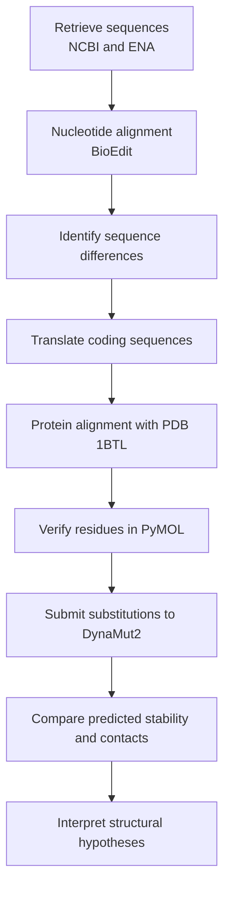

<p align="center">
  
</p>

<h1 align="center">
In Silico Structural Analysis of I84V and V184A Substitutions in TEM β-Lactamase
</h1>

<p align="center">
A sequence- and structure-based comparison of TEM β-lactamase variants from
<i>Escherichia coli</i>
</p>

<p align="center">
  
  
  
  
</p>

---

## Overview

This repository documents an undergraduate bioinformatics project examining the
**I84V** and **V184A** amino-acid substitutions in TEM β-lactamase sequences
from *Escherichia coli*.

The study compares two publicly available coding sequences:

| Accession | Annotated variant | Role in this analysis |
|---|---|---|
| [KJ923009.1](https://www.ncbi.nlm.nih.gov/nuccore/KJ923009.1) | `blaTEM-116` | Sequence containing I84 and V184 |
| [KJ923002.1](https://www.ncbi.nlm.nih.gov/nuccore/KJ923002.1) | `blaTEM-1` | Sequence containing V84 and A184 |

Relative to the sequence represented by KJ923009.1 and the structural reference,
the corresponding substitutions are described as **I84V** and **V184A**.

The translated proteins were compared with the experimentally determined
TEM-1 β-lactamase structure
[PDB 1BTL](https://www.rcsb.org/structure/1BTL). Residue positions were inspected
in PyMOL, while mutation-associated stability and local interaction changes were
evaluated using DynaMut2.

This project generates **structural hypotheses**. It does not experimentally
demonstrate changes in enzyme activity or antibiotic resistance.

---

## Research Question

How might the I84V and V184A substitutions affect the local structural
environment and predicted stability of TEM β-lactamase?

---

## Objectives

1. Retrieve TEM β-lactamase nucleotide sequences from public databases.
2. align the coding sequences and identify nucleotide differences.
3. translate the coding sequences into amino-acid sequences.
4. confirm the I84V and V184A substitutions by protein alignment.
5. align the translated proteins with the PDB 1BTL sequence.
6. verify residue numbering and mutation locations in PyMOL.
7. examine mutation-associated stability and residue-interaction changes using
   DynaMut2.
8. interpret the predictions without treating them as experimental evidence of
   altered resistance.

---

## Workflow



---

## Data and Structural Reference

### Nucleotide sequences

The analyzed coding sequences are stored in:

- [`sequences/01_blaTEM-1_complete_CDS.fasta`](sequences/01_blaTEM-1_complete_CDS.fasta)

The corresponding translations are stored in:

- [`sequences/02_blaTEM-1_translated_proteins.fasta`](sequences/02_blaTEM-1_translated_proteins.fasta)

### Protein alignment

The translated proteins and PDB 1BTL chain A sequence are provided in:

- [`sequences/main file with align with pdb file protein.fas`](sequences/main%20file%20with%20align%20with%20pdb%20file%20protein.fas)

The alignment shows that the KJ923009.1 translation matches the analyzed 1BTL
sequence at the investigated sites, whereas KJ923002.1 contains V at position 84
and A at position 184.

### Protein structure

| Property | Description |
|---|---|
| Structure | TEM-1 β-lactamase |
| PDB identifier | [1BTL](https://www.rcsb.org/structure/1BTL) |
| Experimental method | X-ray crystallography |
| Organism | *Escherichia coli* |
| Local file | [`structures/1BTL.pdb`](structures/1BTL.pdb) |

Residue numbering must be checked carefully because TEM β-lactamase sequences
may be described using precursor, mature-protein, PDB, or Ambler numbering
systems. The substitution labels used in this repository follow the numbering
applied during the original sequence-to-structure alignment.

---

## Methods

### 1. Sequence retrieval

The nucleotide records were obtained from public sequence databases, including
NCBI GenBank and the European Nucleotide Archive.

The accession numbers were retained in the FASTA headers to preserve the link
between each analyzed sequence and its public record.

### 2. Nucleotide alignment

The coding sequences were aligned in BioEdit to identify nucleotide differences.
Sequence orientation and coding-frame continuity were checked before
translation.

### 3. Protein translation and comparison

The coding sequences were translated into amino-acid sequences. The translated
proteins were then compared with each other and with the sequence associated
with PDB 1BTL.

This comparison identified the amino-acid differences investigated as I84V and
V184A.

### 4. Structural inspection

The 1BTL coordinate file was opened in PyMOL to:

- inspect the overall protein structure;
- verify residue positions;
- locate residues 84 and 184;
- examine their local structural environments; and
- save visualization sessions for later inspection.

### 5. DynaMut2 analysis

The I84V and V184A substitutions were assessed independently using
[DynaMut2](https://biosig.lab.uq.edu.au/dynamut2/).

DynaMut2 predictions were used to examine possible changes in protein stability
and local residue interactions. These predictions are computational estimates,
not direct measurements of folding stability, catalytic activity, or
antimicrobial susceptibility.

---

## Results

### Sequence comparison

The two analyzed protein sequences differ at the investigated positions:

| Substitution | Reference residue | Alternative residue | Amino-acid property change |
|---|---:|---:|---|
| I84V | Isoleucine | Valine | Conservative hydrophobic substitution |
| V184A | Valine | Alanine | Hydrophobic substitution to a smaller side chain |

Both substitutions preserve a nonpolar amino-acid character. However, reducing
side-chain volume can alter local packing and neighboring contacts.

### Local interaction counts

The following values were transcribed from the interaction analyses preserved
in the project:

| Interaction type | I84 wild type | I84V mutant | V184 wild type | V184A mutant |
|---|---:|---:|---:|---:|
| Steric clashes | 2 | 2 | 0 | 0 |
| Aromatic interactions | 0 | 0 | 0 | 0 |
| Van der Waals contacts | 1 | 2 | 0 | 3 |
| Hydrophobic contacts | 6 | 4 | 6 | 1 |
| Hydrogen bonds | 6 | 7 | 5 | 4 |
| Polar contacts | 6 | 6 | 6 | 5 |
| Carbonyl interactions | 0 | 0 | 0 | 0 |
| Ionic interactions | 0 | 0 | 0 | 0 |

### Interpretation of I84V

The I84V model showed:

- a reduction in counted hydrophobic contacts;
- one additional van der Waals contact;
- one additional hydrogen bond;
- no change in the recorded number of clashes or polar contacts.

These differences are consistent with a localized rearrangement around residue
84. Interaction counts alone cannot establish whether the substitution improves
or impairs enzyme function.

### Interpretation of V184A

The V184A model showed:

- a marked reduction in counted hydrophobic contacts;
- an increase in van der Waals contacts;
- small reductions in hydrogen-bond and polar-contact counts; and
- no recorded steric clashes.

Because alanine has a smaller side chain than valine, the substitution may
change local packing around residue 184. Confirmation would require additional
computational and experimental evidence.

### Stability results

DynaMut2 ΔΔG values are not currently reported in a machine-readable results
file in this repository. Therefore, this README does not assign either
substitution as stabilizing or destabilizing.

The exact ΔΔG values, units, chain selection, uploaded structure, and DynaMut2
run details should be added before making a directional stability conclusion.

---

## Key Findings

- The analyzed sequences contain amino-acid differences corresponding to I84V
  and V184A.
- Both are conservative or semi-conservative substitutions involving nonpolar
  residues.
- The structural models indicate changes in local interaction networks.
- V184A produced the larger reduction in counted hydrophobic contacts.
- The available evidence supports localized structural hypotheses, not claims
  of altered catalytic activity or resistance phenotype.
- Experimental validation is required before connecting these substitutions to
  antibiotic susceptibility.

---

## Repository Structure

```text
blaTEM-1-Escherichia-coli/
├── README.md
├── LICENSE
├── banner.png
├── alignment/
│   ├── 01_blaTEM-1_complete_CDS.fasta
│   ├── 02_blaTEM-1_translated_proteins.fasta
│   ├── main file with align with pdb file protein.fas
│   └── README.md
├── data/
│   ├── metadata.md
│   └── README.md
├── docs/
│   ├── PROJECT_SUMMARY.md
│   └── README.md
├── dynamut2/
│   ├── interaction images
│   └── README.md
├── figures/
│   └── README.md
├── pymol/
│   ├── PyMOL session files
│   └── README.md
├── results/
│   ├── interaction_analysis.md
│   ├── stability_analysis.md
│   └── README.md
├── sequences/
│   ├── nucleotide and protein FASTA files
│   └── README.md
├── structures/
│   ├── 1BTL.pdb
│   └── README.md
└── workflow/
    └── README.md
```

The `alignment/` and `sequences/` directories currently contain duplicate
sequence files. They have been retained to preserve the original project
organization.

---

## Reproducing the Analysis

### Requirements

- BioEdit or another validated sequence-alignment program
- PyMOL
- Access to DynaMut2
- The sequence and structure files supplied in this repository

### Procedure

1. Download the two nucleotide records using their accession numbers.
2. Confirm that both sequences are in the same orientation.
3. align the complete coding sequences.
4. translate the sequences using the bacterial genetic code.
5. compare the translated proteins and verify the two substitutions.
6. align the translated sequences with PDB 1BTL chain A.
7. confirm how sequence numbering maps to PDB residue numbering.
8. open `structures/1BTL.pdb` in PyMOL.
9. inspect residues 84 and 184 and their neighboring residues.
10. submit I84V and V184A separately to DynaMut2.
11. record the predicted ΔΔG value, units, chain, date, parameters, and output.
12. compare the predictions with the archived interaction images.

Results may differ if database records, software versions, structural
preparation, chain selection, or server algorithms change.

---

## Scientific Scope

This study includes:

- public sequence retrieval;
- nucleotide and protein comparison;
- mutation identification;
- sequence-to-structure alignment;
- structural visualization;
- predicted stability analysis; and
- local residue-interaction comparison.

It does not include:

- antimicrobial susceptibility testing;
- minimum inhibitory concentration measurements;
- enzyme expression or purification;
- enzyme kinetic assays;
- site-directed mutagenesis;
- molecular dynamics simulations;
- antibiotic docking;
- clinical isolate characterization; or
- experimental structural validation.

Consequently, terms such as “increased resistance,” “reduced activity,” or
“altered catalytic efficiency” cannot be concluded from the present results.

---

## Limitations

1. Only two database sequences were directly compared.
2. The analysis does not establish how common these substitutions are in
   bacterial populations.
3. Exact software versions and all analysis settings are not completely
   documented.
4. DynaMut2 ΔΔG values are not reported in a structured results table.
5. Local interaction counts depend on the selected model and computational
   definitions.
6. No independent stability-prediction method was used for comparison.
7. No evolutionary conservation analysis was performed.
8. No laboratory experiments were conducted.
9. The relationship between precursor, mature-protein, PDB, and Ambler residue
   numbering requires explicit documentation.
10. Structural predictions cannot independently determine an antimicrobial
    resistance phenotype.

---

## Recommended Future Work

- Add exact DynaMut2 ΔΔG values and complete run metadata.
- Confirm residue positions using Ambler numbering.
- Evaluate residue conservation across representative TEM variants.
- Compare predictions using additional validated stability tools.
- Perform molecular-dynamics simulations to investigate conformational effects.
- Test purified variants using enzyme kinetic assays.
- evaluate antibiotic susceptibility using isogenic bacterial strains.
- Link structural findings with genomic and epidemiological data.

---

## Data Availability

All project files used for the reported analysis are available in this
repository. The original nucleotide records and structural model can also be
retrieved from their respective public databases:

- [NCBI record KJ923009.1](https://www.ncbi.nlm.nih.gov/nuccore/KJ923009.1)
- [NCBI record KJ923002.1](https://www.ncbi.nlm.nih.gov/nuccore/KJ923002.1)
- [RCSB PDB entry 1BTL](https://www.rcsb.org/structure/1BTL)

---

## Suggested Citation

> Ullah, A. (2026). *In silico structural analysis of I84V and V184A
> substitutions in TEM β-lactamase*. GitHub.
> https://github.com/atahullah/blaTEM-1-Escherichia-coli

```bibtex
@misc{Ullah2026TEM,
  author       = {Ullah, Atah},
  title        = {In Silico Structural Analysis of I84V and V184A
                  Substitutions in TEM Beta-Lactamase},
  year         = {2026},
  publisher    = {GitHub},
  url          = {https://github.com/atahullah/blaTEM-1-Escherichia-coli}
}
```

---

## Author

**ATAH ULLAH**  
BS Microbiology, Bacha Khan University, Charsadda, Pakistan

Research interests:

- antimicrobial resistance;
- structural bioinformatics;
- microbial genomics;
- infectious diseases;
- molecular epidemiology; and
- genomic epidemiology.

**Email:** [atahullah.epd.pk@gmail.com](mailto:atahullah.epd.pk@gmail.com)  
**GitHub:** [github.com/atahullah](https://github.com/atahullah)  
**LinkedIn:** [atahullah-bioinformatics](https://www.linkedin.com/in/atahullah-bioinformatics)

### Academic supervision

**Dr. Sajid Ali**  
Bacha Khan University, Charsadda

---

## Acknowledgements

The author acknowledges the organizations and developers responsible for NCBI
GenBank, the European Nucleotide Archive, RCSB Protein Data Bank, BioEdit,
PyMOL, and DynaMut2.

---

## License

This repository is distributed under the [MIT License](LICENSE).

The MIT License covers the repository materials but does not change the
licensing or terms of use of third-party database records, software, or web
services referenced in this project.

---

## Disclaimer

This repository is intended for research, education, and portfolio
documentation. Its computational predictions should not be used as clinical
evidence or as a substitute for microbiological, biochemical, or
epidemiological validation.
